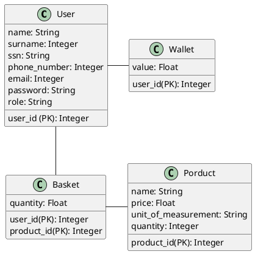

# SPG

SPG SE2_Project

# Database design sprint 1

```plantuml
@startuml
Class User{
    user_id (PK): Integer
    name: String
    surname: Integer
    ssn: String
    phone_number: Integer
    email: Integer
    password: String
    role: String
}
Class Basket{
    user_id(PK): Integer
    product_id(PK): Integer
    quantity: Float
}
Class Porduct{
    product_id(PK): Integer
    name: String
    price: Float
    unit_of_measurement: String
    quantity: Integer
}
Class Wallet{
    user_id(PK): Integer
    value: Float
}
User--Basket
Basket - Porduct
User-Wallet
@enduml
```
